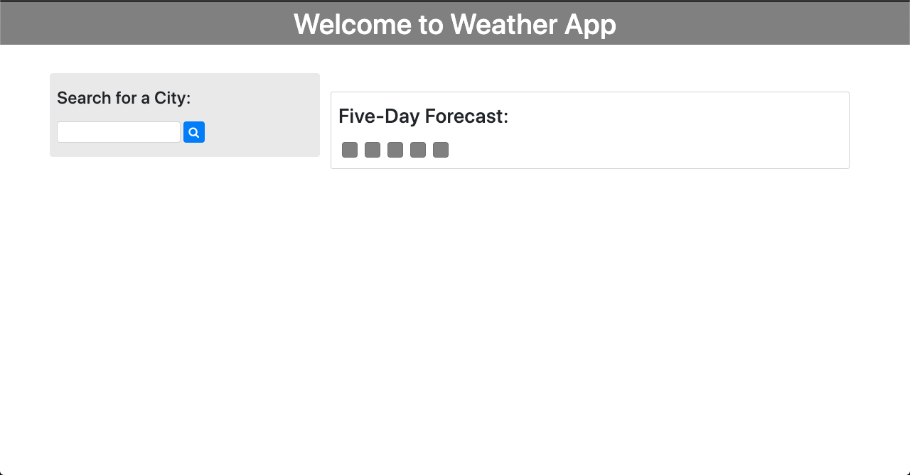
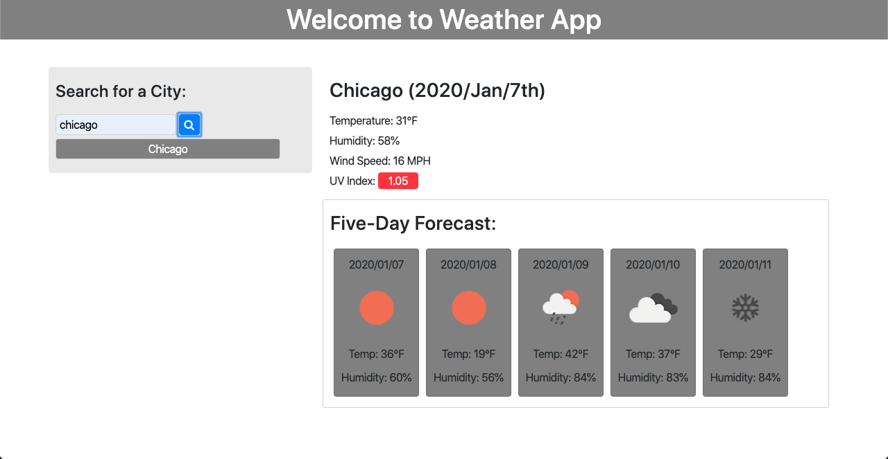
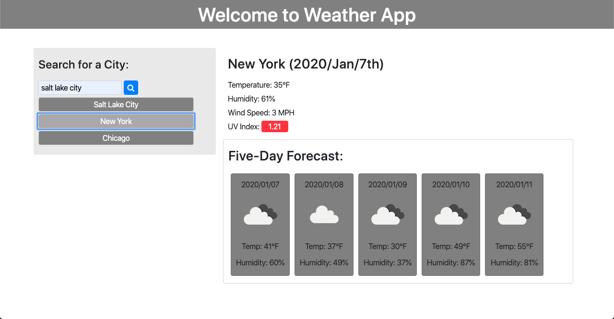

# Weather App
* Here is the weather app that is for the 06 homework

---
here is a demo video of the app working
;

#### On load up

#### First entry

#### Choosing a recently searched


### Had help with re appending items after I had broke it when refactoring my bud Aaron helped me see that since I had the button being made outside as a global variable, it wasn't making a new button each time instead it was just re-writing that button
```
const addedCities = {}


function addRecSeBtn(cityName) {
    if (addedCities[cityName]) { return }
    addedCities[cityName] = true;
    var b = $("<button type='submit' data-value='" + buttonCount + "'>");
    b.addClass("searched");
    b.text(cityName)
    // storing the searched city to a p tag below inside the search div
    $("#serched-cities").prepend(b);
}
```
### He also helped me figure out why it was doubling with every time the recently searched button got pressed. basically it was adding an event listener each time the code ran and in reality that is not what I wanted but he introduced me to the unbind() method so that every time the code ran i would not repeat putting a event listener on the recently created button
```
$(".searched")
        .unbind('click')
        .on("click", function (event) {
            event.preventDefault()
            var btnValue = $(this).data('value');
            console.log(btnValue);
            //grab local storage url
            var dataAttr = 'cityName-' + btnValue;
            // var dataAttr = cityName- + btnValue
            var recSearchedURL = localStorage.getItem(dataAttr)
            // var recSearchedURL = getItem(dataAttr)
            ajaxCall(recSearchedURL)
            //run ajax function passing that url into it. 
            console.log('*******')
            // console.log(gotKey)
        })
``` 
### He had also shown me how to not nest ajax calls so deeply
```
function ajaxCall(dataUrl) {
    //put ajax here
    $.ajax({
        url: dataUrl,
        method: "GET"
    }).then(function (res) {
        console.log(res)
        console.log('***** ajax call function ********')
        buildHTML(res)
        btnRes = res;
        var lon = res.city.coord.lon;
        var lat = res.city.coord.lat;
        var uvIndexURL = "http://api.openweathermap.org/data/2.5/uvi?APPID="
        var secondURL = uvIndexURL + apiKey + '&lon=' + lon + '&lat=' + lat;
        var currIndex;
        return $.ajax({
            url: secondURL,
            method: "GET"
        })
    }).then(function (resTwo) {
        console.log('------ second Ajax call-----------')
        console.log(resTwo)
        currIndex = resTwo.value;
        currentData.append("<p> UV Index: " + "<span class='uv-index'>" + currIndex + "</span>" + "</p>")
        console.log(currIndex)
        return $.ajax({
            url: secondURL,
            method: "GET"
        })
    }).then(function (resTwo) {
        console.log('------ second Ajax call-----------')
        console.log(resTwo)
        currIndex = resTwo.value;
        currentData.append("<p> UV Index: " + "<span class='uv-index'>" + currIndex + "</span>" + "</p>")
        console.log(currIndex)
    })
}
```
### Also Riley helped a ton as well! hyped for all the help and being able to understand how it all works and came together. this was a really in depth HW really had to think this one through a ton.


---
##  License and Copyright 
© Tom Ruff, U of U Full Stack Bootcamp